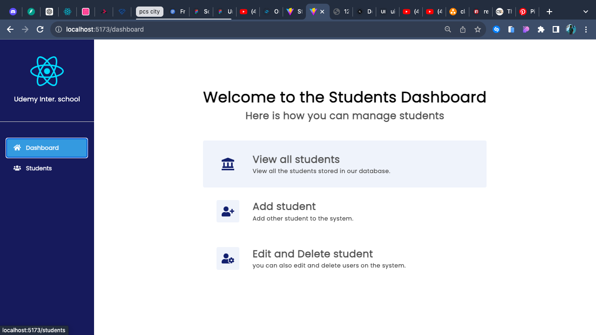
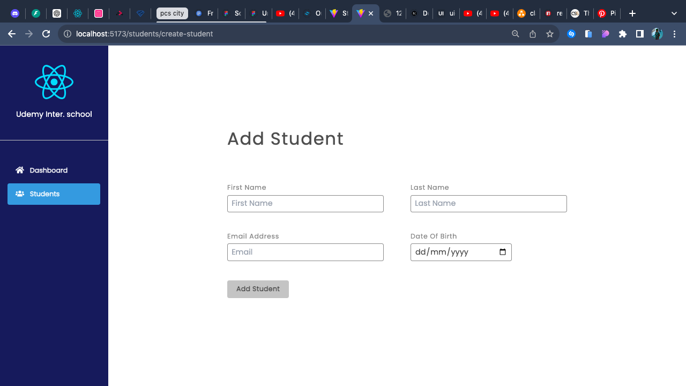
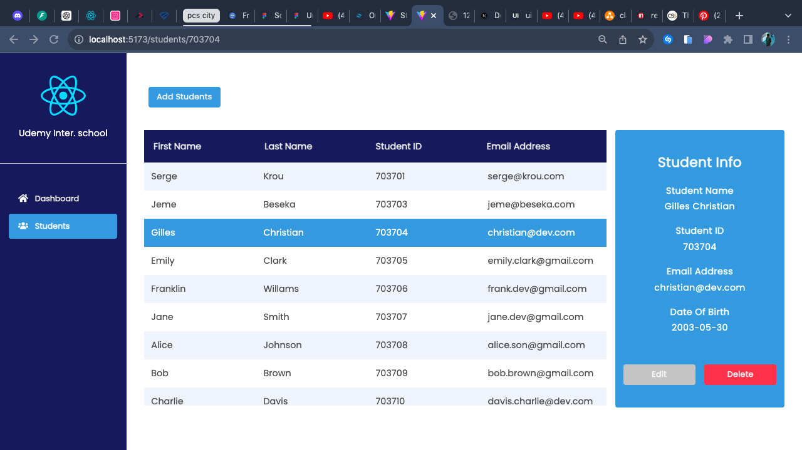
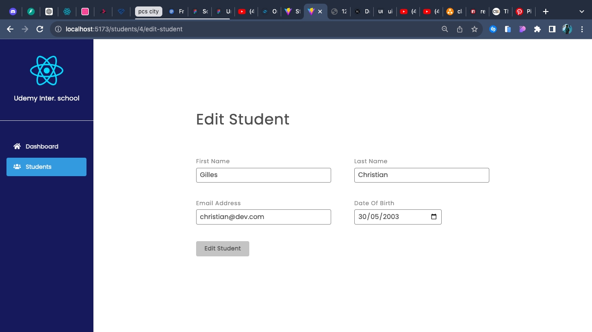

# Student Management Dashboard
Implementation of a user-friendly interface that interacts seamlessly with a Student Management API. The interface allow the users to perform CRUD (Create, Read, Update, Delete) operations on student data.
## Dashboard UI

## Add Student UI

## All Students UI

## Edit Student UI

